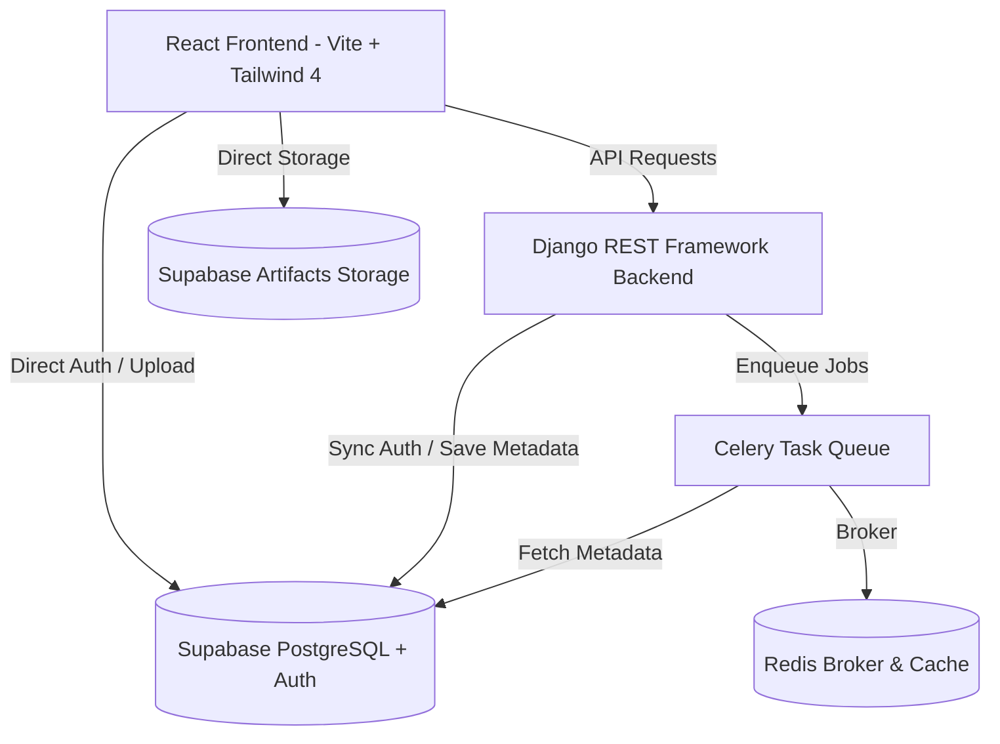

# CAIP · Cloud Architecture Intelligence Platform

CAIP (Cloud Architecture Intelligence Platform) is an automated system designed to understand git repositories, deployment infrastructure, and business requirements to generate cloud architecture analysis and design recommendations.

The platform discovers technical structures (languages, frameworks, containers, cloud resources) and merges them with non-technical business parameters (SLA, compliance targets, budget constraints) to output service maps and architecture patterns.

---

## Architecture Overview

CAIP is built using a modern decoupled client-server architecture:



### Key Components

- **Frontend**: A highly responsive Single Page Application built on React (Vite, Tailwind v4, Radix UI Primitives, Lucide icons, next-themes). Supports visual transitions, light/dark mode switcher, project dashboard grid, table rows, and interactive tabs.
- **Backend**: Django & Django REST Framework (DRF) exposing secure endpoints. Utilizes custom `SupabaseAuthentication` middleware to validate Supabase JWT tokens.
- **Task Queue**: Celery (backed by Redis) executing asynchronous background repository analysis pipelines (cloning, scanning files, detecting code properties).
- **Database & Storage**: Supabase PostgreSQL for persistent metadata, Supabase Auth for authentication, and Supabase Storage buckets for context document artifacts.

---

## Directory Structure

```
CAIP/
├── backend/                  # Django REST Framework Backend
│   ├── apps/
│   │   ├── analysis/         # Celery job pipelines for code indexing
│   │   ├── artifacts/        # Project context document uploads & metadata
│   │   ├── authentication/   # Supabase JWT authentication middleware
│   │   ├── github/           # GitHub App installation webhook & router
│   │   ├── knowledge/        # Unified knowledge base items & relationships
│   │   ├── projects/         # Project CRUD and endpoints
│   │   └── repositories/     # Repository connections
│   ├── core/                 # Settings, router, WSGI configurations
│   ├── services/             # Core logic for analyzing & gathering kb
│   └── manage.py
├── frontend/                 # React SPA (Vite + Tailwind CSS v4)
│   ├── src/
│   │   ├── app/
│   │   │   ├── components/   # UI Layouts, Dashboard, Tabs, Wizards
│   │   │   ├── data/         # TypeScript definitions & Mock data
│   │   │   └── utils/        # Axios API clients, auth sync helpers
│   │   ├── lib/              # Supabase Client initializations
│   │   └── styles/           # Fonts, theme, global css utilities
│   ├── package.json
│   └── vite.config.ts
├── PROJECT_PHASES.md         # Long term development phases (Phases 1-8)
└── sprint_01.txt             # Sprint 1 goal boundaries & deliverables checklist
```

---

## Tech Stack

- **Core**: Python 3.12, Node.js 20+, TypeScript
- **Backend Framework**: Django, Django REST Framework, Celery
- **Frontend Framework**: React 18, Vite, Tailwind CSS v4, Radix UI
- **Database**: Supabase (PostgreSQL), Redis (as Celery Broker)
- **APIs & Webhooks**: GitHub App API integration

---

## Core Features (Latest Release)

1. **Authentication & Session Sync**: Supabase Auth client-side login/signup synchronized with Django REST Framework JWT headers.
2. **Project Workspace Manager**: Create, list, delete, and view cloud architecture design projects in a responsive card grid.
3. **Repository Discovery Wizard**: Integration with GitHub App (cloning/accessing private and public repositories without PAT tokens).
4. **Structured Context Inputs**: Forms configuring Growth Rate, Criticality Tiers (Tier 1-3), Cost limits, Compliance rules (GDPR, HIPAA, SOC2, PCI-DSS), and SLA targets (SLA, RTO, RPO).
5. **PDF Context Artifacts**: Enforces a strict upload limit of exactly **1 document** (BRDs, Security Reports, ADRs) per category, limited to a maximum length of **5 pages** (with automatic PDF page length checks).
6. **Unified Knowledge Base View**: A visual tab that fetches `/api/projects/{id}/knowledge-base/` to aggregate business details, SLA matrices, and uploaded documents in a unified view.
7. **Premium Themes**: Responsive light and dark themes supported via a toggle switcher in the sidebar.

---

## Getting Started

### Prerequisites
- Python (via `uv` recommended)
- Node.js (v18+)
- Redis running locally (default port 6379)

### Running Backend
```bash
cd backend
uv run python manage.py migrate
uv run python manage.py runserver
```

### Running Frontend
```bash
cd frontend
npm install
npm run dev
```
The client will be running on [http://localhost:5173](http://localhost:5173).
